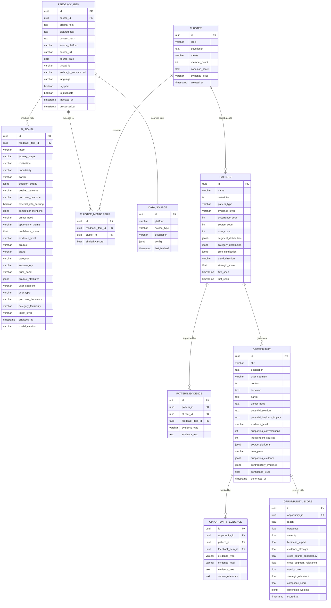
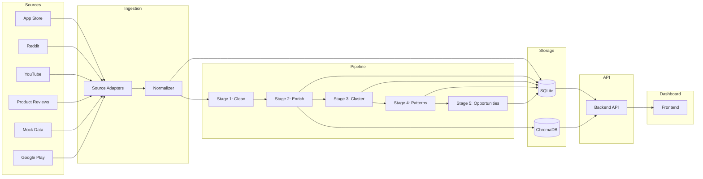
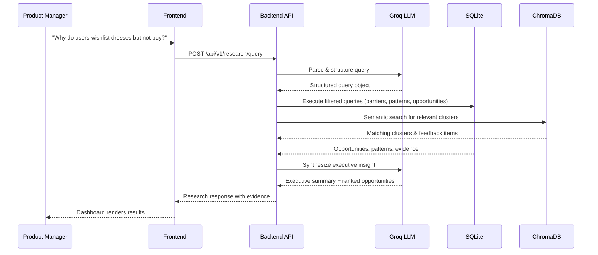

# Architecture — AI-Powered Fashion Purchase Discovery Intelligence Engine

> **Version:** 1.0 (MVP)
> **Last Updated:** 2026-08-18
> **Status:** Draft — Pending Review

---

## Table of Contents

1. [System Overview](#1-system-overview)
2. [Architectural Principles](#2-architectural-principles)
3. [High-Level Architecture](#3-high-level-architecture)
4. [Component Architecture](#4-component-architecture)
5. [Data Model](#5-data-model)
6. [AI Analysis Pipeline](#6-ai-analysis-pipeline)
7. [Opportunity Engine](#7-opportunity-engine)
8. [Natural Language Research Interface](#8-natural-language-research-interface)
9. [API Design](#9-api-design)
10. [Frontend Dashboard](#10-frontend-dashboard)
11. [Evidence & Traceability Layer](#11-evidence--traceability-layer)
12. [Evaluation Framework](#12-evaluation-framework)
13. [Data Flow](#13-data-flow)
14. [Technology Stack](#14-technology-stack)
15. [Project Structure](#15-project-structure)
16. [Deployment Architecture](#16-deployment-architecture)
17. [Extensibility & Future Considerations](#17-extensibility--future-considerations)
18. [Key Architectural Decisions (ADRs)](#18-key-architectural-decisions-adrs)

---

## 1. System Overview

### 1.1 Purpose

The system is an **AI-powered customer discovery and opportunity intelligence engine** designed for Myntra. It transforms fragmented user-generated feedback from multiple sources into structured, evidence-backed **product opportunities** that help Product Managers understand:

- **Why** users behave the way they do during fashion-shopping journeys
- **What** prevents them from progressing toward purchase
- **Which** recurring unmet needs represent meaningful product opportunities

### 1.2 Core Discovery Loop

```
Question → Evidence → Analysis → Pattern → Opportunity → Business Relevance
```

### 1.3 What This System Is NOT

| ❌ Not This | ✅ This Instead |
|---|---|
| Sentiment analysis dashboard | Behavioral intent & barrier discovery engine |
| Review summarization tool | Opportunity intelligence platform |
| Keyword/topic extractor | Evidence-backed unmet-need identifier |
| Word cloud generator | Structured opportunity framework with scoring |

### 1.4 MVP Focus

**Wishlist → Purchase Conversion**: Why do users wishlist fashion products but fail to purchase them, and what product opportunities could increase the probability of purchase?

---

## 2. Architectural Principles

| Principle | Rationale |
|---|---|
| **Simplicity** | MVP-first; avoid over-engineering. Every component should earn its place. |
| **Explainability** | Every insight must be traceable to source evidence. No black-box conclusions. |
| **Evidence Traceability** | Full drill-down path: Opportunity → Pattern → Cluster → Feedback → Source. |
| **Maintainability** | Clean separation of concerns; well-defined interfaces between layers. |
| **Extensibility** | Architecture must support future addition of RAG, MCP, agentic capabilities, and new data sources without restructuring. |
| **Low Infrastructure Complexity** | Minimize operational overhead; prefer managed services and simple deployment. |
| **Observation vs Inference Rigor** | System must distinguish Observed, Derived, and Hypothesized evidence levels at every layer. |

---

## 3. High-Level Architecture

```
┌──────────────────────────────────────────────────────────────────────┐
│                        PRESENTATION LAYER                            │
│  ┌────────────────────────────────────────────────────────────────┐  │
│  │              Frontend Dashboard (Next.js / React)              │  │
│  │  ┌──────────┐ ┌───────────┐ ┌──────────┐ ┌────────────────┐  │  │
│  │  │ Research  │ │Opportunity│ │ Journey  │ │   Evidence     │  │  │
│  │  │ Question  │ │   Map     │ │ Explorer │ │   Drill-Down   │  │  │
│  │  │ Interface │ │           │ │          │ │                │  │  │
│  │  └──────────┘ └───────────┘ └──────────┘ └────────────────┘  │  │
│  │  ┌──────────┐ ┌───────────┐ ┌──────────┐ ┌────────────────┐  │  │
│  │  │ Segment  │ │  Trend    │ │ Decision │ │ Contradiction  │  │  │
│  │  │ Comparer │ │  Analysis │ │ Factors  │ │    Panel       │  │  │
│  │  └──────────┘ └───────────┘ └──────────┘ └────────────────┘  │  │
│  └────────────────────────────────────────────────────────────────┘  │
├──────────────────────────────────────────────────────────────────────┤
│                          API LAYER                                   │
│  ┌────────────────────────────────────────────────────────────────┐  │
│  │                Backend API (FastAPI / Python)                   │  │
│  │  ┌──────────┐ ┌───────────┐ ┌──────────┐ ┌────────────────┐  │  │
│  │  │ Research  │ │Opportunity│ │ Evidence │ │   Segment      │  │  │
│  │  │ Query API │ │   API     │ │   API    │ │   API          │  │  │
│  │  └──────────┘ └───────────┘ └──────────┘ └────────────────┘  │  │
│  │  ┌──────────┐ ┌───────────┐ ┌──────────┐                    │  │
│  │  │ Ingestion│ │  Pipeline │ │  Trend   │                    │  │
│  │  │   API    │ │ Status API│ │   API    │                    │  │
│  │  └──────────┘ └───────────┘ └──────────┘                    │  │
│  └────────────────────────────────────────────────────────────────┘  │
├──────────────────────────────────────────────────────────────────────┤
│                      INTELLIGENCE LAYER                              │
│  ┌────────────────────────────────────────────────────────────────┐  │
│  │                AI Analysis Pipeline (Python)                    │  │
│  │                                                                │  │
│  │  Stage 1        Stage 2          Stage 3         Stage 4       │  │
│  │  ┌────────┐    ┌───────────┐    ┌──────────┐   ┌───────────┐ │  │
│  │  │Cleaning│ →  │ Semantic  │ →  │ Semantic │ → │  Pattern  │ │  │
│  │  │& Dedup │    │Enrichment │    │Clustering│   │ Detection │ │  │
│  │  └────────┘    │  (Groq)   │    │          │   └───────────┘ │  │
│  │                └───────────┘    └──────────┘         │       │  │
│  │                                                      ▼       │  │
│  │                                               Stage 5        │  │
│  │  ┌────────────────────────────────────────┐  ┌───────────┐   │  │
│  │  │        Opportunity Scoring Engine       │←│Opportunity│   │  │
│  │  │  (Reach · Frequency · Severity · …)    │  │Generation │   │  │
│  │  └────────────────────────────────────────┘  └───────────┘   │  │
│  └────────────────────────────────────────────────────────────────┘  │
├──────────────────────────────────────────────────────────────────────┤
│                        DATA LAYER                                    │
│  ┌──────────────────────┐  ┌──────────────────────────────────────┐ │
│  │   Relational DB      │  │  Optional: Vector Store              │ │
│  │   (PostgreSQL)       │  │  (pgvector / ChromaDB)               │ │
│  │                      │  │                                      │ │
│  │  • Feedback Items    │  │  • Semantic Embeddings               │ │
│  │  • Enriched Signals  │  │  • Similarity Search Index           │ │
│  │  • Clusters          │  │                                      │ │
│  │  • Patterns          │  │                                      │ │
│  │  • Opportunities     │  │                                      │ │
│  │  • Evidence Links    │  │                                      │ │
│  │  • Audit Trail       │  │                                      │ │
│  └──────────────────────┘  └──────────────────────────────────────┘ │
├──────────────────────────────────────────────────────────────────────┤
│                      INGESTION LAYER                                 │
│  ┌──────────────────────────────────────────────────────────────────┐│
│  │               Data Ingestion Service                             ││
│  │  ┌──────────┐ ┌────────┐ ┌────────┐ ┌────────┐ ┌────────────┐ ││
│  │  │ App Store│ │ Reddit │ │YouTube │ │Product │ │   Mock /   │ ││
│  │  │ Adapter  │ │Adapter │ │Adapter │ │Reviews │ │  Sample    │ ││
│  │  │          │ │        │ │        │ │Adapter │ │  Data Seed │ ││
│  │  └──────────┘ └────────┘ └────────┘ └────────┘ └────────────┘ ││
│  └──────────────────────────────────────────────────────────────────┘│
└──────────────────────────────────────────────────────────────────────┘
```

---

## 4. Component Architecture

### 4.1 Ingestion Layer

Responsible for collecting and normalizing raw feedback from heterogeneous sources into a unified format.

```
┌─────────────────────────────────────────────────────────┐
│                  Ingestion Service                       │
│                                                         │
│  ┌─────────────────┐     ┌───────────────────────────┐ │
│  │  Source Adapter  │     │   Adapter Interface       │ │
│  │  Registry        │────▶│   (Abstract Base Class)   │ │
│  └─────────────────┘     └───────────────────────────┘ │
│                                    │                    │
│          ┌─────────────────────────┼──────────────┐     │
│          ▼                         ▼              ▼     │
│  ┌──────────────┐  ┌──────────────────┐  ┌───────────┐ │
│  │ AppStore     │  │ Reddit           │  │ Mock/Seed │ │
│  │ Adapter      │  │ Adapter          │  │ Adapter   │ │
│  └──────────────┘  └──────────────────┘  └───────────┘ │
│                                                         │
│  ┌─────────────────────────────────────────────────┐   │
│  │            Normalizer                            │   │
│  │  • Unified schema mapping                        │   │
│  │  • Source metadata preservation                  │   │
│  │  • Deduplication hash generation                 │   │
│  └─────────────────────────────────────────────────┘   │
└─────────────────────────────────────────────────────────┘
```

**Key Design Decisions:**
- Each data source implements a common `SourceAdapter` interface with `fetch()`, `normalize()`, and `validate()` methods.
- The MVP ships with a `MockDataAdapter` that loads realistic synthetic data, making the system demonstrable end-to-end.
- New sources can be added by implementing the adapter interface — no core changes required.
- The normalizer maps source-specific fields to the unified `FeedbackItem` schema (see §5).

---

### 4.2 AI Analysis Pipeline

The intelligence core of the system. Processes raw feedback through five sequential stages.

```
┌─────────┐    ┌───────────┐    ┌───────────┐    ┌──────────┐    ┌────────────┐
│ Stage 1  │    │  Stage 2   │    │  Stage 3   │    │ Stage 4  │    │  Stage 5   │
│          │    │            │    │            │    │          │    │            │
│ Cleaning │───▶│ Semantic   │───▶│ Semantic   │───▶│ Pattern  │───▶│Opportunity │
│ & Dedup  │    │ Enrichment │    │ Clustering │    │Detection │    │ Generation │
│          │    │   (Groq)   │    │            │    │          │    │            │
└─────────┘    └───────────┘    └───────────┘    └──────────┘    └────────────┘
     │               │                │                │                │
     ▼               ▼                ▼                ▼                ▼
  Raw Text      AI-Derived       Semantic          Recurring       Opportunities
  Cleaned       Signals          Clusters          Patterns        & Unmet Needs
```

Each stage is an independent, stateless processor that reads from and writes to the database. This enables:
- **Re-runnability**: Any stage can be re-executed independently.
- **Observability**: Each stage logs its inputs, outputs, and quality metrics.
- **Extensibility**: New stages can be inserted without disrupting the pipeline.

See [§6 — AI Analysis Pipeline](#6-ai-analysis-pipeline) for detailed stage specifications.

---

### 4.3 Backend API

A RESTful API layer that orchestrates data access, pipeline execution, and research query handling.

```
┌──────────────────────────────────────────────────────────────┐
│                     FastAPI Application                       │
│                                                              │
│  ┌──────────────────────────────────────────────────────┐   │
│  │                    Middleware                          │   │
│  │  • CORS  • Request Logging  • Error Handling          │   │
│  └──────────────────────────────────────────────────────┘   │
│                                                              │
│  ┌──────────────┐  ┌──────────────┐  ┌──────────────────┐  │
│  │  /research    │  │ /opportunities│  │  /evidence       │  │
│  │  Research     │  │ Opportunity   │  │  Evidence         │  │
│  │  Query Router │  │ Router        │  │  Router           │  │
│  └──────┬───────┘  └──────┬───────┘  └────────┬─────────┘  │
│         │                 │                    │             │
│  ┌──────▼─────────────────▼────────────────────▼──────────┐ │
│  │                   Service Layer                         │ │
│  │  ┌────────────┐ ┌─────────────┐ ┌───────────────────┐  │ │
│  │  │  Research   │ │ Opportunity │ │   Evidence        │  │ │
│  │  │  Service    │ │ Service     │ │   Service         │  │ │
│  │  └────────────┘ └─────────────┘ └───────────────────┘  │ │
│  │  ┌────────────┐ ┌─────────────┐ ┌───────────────────┐  │ │
│  │  │  Ingestion │ │  Pipeline   │ │   Segment         │  │ │
│  │  │  Service   │ │  Service    │ │   Service          │  │ │
│  │  └────────────┘ └─────────────┘ └───────────────────┘  │ │
│  └────────────────────────────────────────────────────────┘ │
│                                                              │
│  ┌────────────────────────────────────────────────────────┐  │
│  │                  Data Access Layer                      │  │
│  │  • SQLAlchemy ORM  • Repository pattern                │  │
│  │  • Connection pooling  • Migration support (Alembic)   │  │
│  └────────────────────────────────────────────────────────┘  │
└──────────────────────────────────────────────────────────────┘
```

---

### 4.4 Frontend Dashboard

A PM-oriented interface for exploring opportunities, posing research questions, and drilling into evidence.

```
┌─────────────────────────────────────────────────────────────────┐
│                     Dashboard Application                        │
│                                                                  │
│  ┌─────────────────────────────────────────────────────────┐    │
│  │  Research Question Bar (Natural Language Input)          │    │
│  └─────────────────────────────────────────────────────────┘    │
│                                                                  │
│  ┌──────────────┐  ┌────────────────────────────────────────┐   │
│  │              │  │  Main Content Area                      │   │
│  │  Navigation  │  │                                        │   │
│  │  Sidebar     │  │  ┌────────────────────────────────┐    │   │
│  │              │  │  │  Executive Insight Panel        │    │   │
│  │  • Overview  │  │  └────────────────────────────────┘    │   │
│  │  • Opps      │  │                                        │   │
│  │  • Journey   │  │  ┌─────────────┐ ┌──────────────────┐  │   │
│  │  • Segments  │  │  │ Opportunity │ │  Journey Stage   │  │   │
│  │  • Factors   │  │  │ Map (Ranked)│ │  Visualization   │  │   │
│  │  • Evidence  │  │  └─────────────┘ └──────────────────┘  │   │
│  │  • Trends    │  │                                        │   │
│  │  • Settings  │  │  ┌─────────────┐ ┌──────────────────┐  │   │
│  │              │  │  │  Decision   │ │  Segment         │  │   │
│  │              │  │  │  Factors    │ │  Comparison      │  │   │
│  │              │  │  └─────────────┘ └──────────────────┘  │   │
│  │              │  │                                        │   │
│  │              │  │  ┌─────────────┐ ┌──────────────────┐  │   │
│  │              │  │  │  Evidence   │ │  Contradictions  │  │   │
│  │              │  │  │  Panel      │ │  Panel           │  │   │
│  │              │  │  └─────────────┘ └──────────────────┘  │   │
│  └──────────────┘  └────────────────────────────────────────┘   │
└─────────────────────────────────────────────────────────────────┘
```

---

## 5. Data Model

### 5.1 Entity Relationship Diagram



### 5.2 Evidence Level Enum

All entities that carry conclusions use a strict three-level evidence classification:

| Level | Code | Definition | Example |
|---|---|---|---|
| **Observed** | `OBSERVED` | Directly present in source text | "I'm unsure if this dress will fit me" |
| **Derived** | `DERIVED` | Pattern supported by multiple observations | Fit uncertainty appears frequently among dress shoppers |
| **Hypothesized** | `HYPOTHESIZED` | Potential explanation or business implication | Fit uncertainty may contribute to wishlist-to-purchase drop-off |

### 5.3 Journey Stage Enum

```
DISCOVERY → BROWSING → PRODUCT_CONSIDERATION → SHORTLISTING → COMPARISON
→ WISHLIST → EVALUATION → PURCHASE → PURCHASE_POSTPONEMENT → ABANDONMENT
→ POST_PURCHASE
```

### 5.4 Indexing Strategy

| Table | Index | Purpose |
|---|---|---|
| `feedback_item` | `(source_platform, source_date)` | Source-based filtering |
| `feedback_item` | `(content_hash)` UNIQUE | Deduplication |
| `ai_signal` | `(journey_stage, barrier)` | Journey-stage queries |
| `ai_signal` | `(category, subcategory)` | Category-based filtering |
| `ai_signal` | `(evidence_level)` | Evidence-level filtering |
| `cluster` | `(theme)` | Theme-based lookups |
| `pattern` | `(trend_direction, strength_score)` | Trend analysis |
| `opportunity` | `(evidence_level, confidence_level)` | Opportunity ranking |
| `opportunity_score` | `(composite_score DESC)` | Ranked opportunity retrieval |

---

## 6. AI Analysis Pipeline

### 6.1 Stage 1 — Cleaning & Deduplication

```
Input:  Raw FeedbackItem records
Output: Cleaned FeedbackItem records (is_spam, is_duplicate flags set)
```

| Step | Technique | Details |
|---|---|---|
| Spam detection | Rule-based + LLM fallback | Promotional content, bot-generated text, irrelevant feedback |
| Deduplication | Content hashing (SHA-256 on normalized text) | Exact and near-duplicate detection |
| Text normalization | Lowercasing, whitespace normalization, encoding fixes | Preserve original text in `original_text` field |
| Language detection | `langdetect` / `lingua` library | Tag language; flag non-English for separate handling |
| Context preservation | Source metadata retained | Original URL, thread context, author preserved |

### 6.2 Stage 2 — Semantic Enrichment (Groq LLM)

```
Input:  Cleaned FeedbackItem
Output: AI_Signal record linked to FeedbackItem
```

Uses **Groq LLM API** with structured output (JSON mode) to extract signals from each feedback item.

**Prompt Engineering Strategy:**
```
┌───────────────────────────────────────────────────┐
│              System Prompt                         │
│  • Role: Fashion shopping behavior analyst         │
│  • Task: Extract structured signals                │
│  • Output: Strict JSON schema                      │
│  • Evidence rules: Mark confidence, distinguish    │
│    observed vs derived                             │
│  • Guardrails: Never fabricate, never assume       │
└───────────────────────────────────────────────────┘
                      │
                      ▼
┌───────────────────────────────────────────────────┐
│              User Prompt                           │
│  • Feedback text                                   │
│  • Source context (platform, date, category)        │
│  • Extraction targets: intent, journey_stage,      │
│    motivation, uncertainty, barrier,               │
│    decision_criteria, outcome, product/category,   │
│    attributes, unmet_need                          │
└───────────────────────────────────────────────────┘
                      │
                      ▼
┌───────────────────────────────────────────────────┐
│         Structured JSON Output                     │
│  {                                                 │
│    "intent": "...",                                │
│    "journey_stage": "...",                         │
│    "barrier": "...",                               │
│    "confidence": 0.85,                             │
│    "evidence_level": "OBSERVED",                   │
│    ...                                             │
│  }                                                 │
└───────────────────────────────────────────────────┘
```

**Rate Limiting & Error Handling:**
- Batch processing with configurable concurrency (default: 10 concurrent requests)
- Exponential backoff on rate-limit errors (429)
- Failed items queued for retry (max 3 attempts)
- Timeout: 30s per request

### 6.3 Stage 3 — Semantic Clustering

```
Input:  Enriched AI_Signal records
Output: Cluster records + ClusterMembership links
```

**Approach:**
1. Generate text embeddings using a lightweight embedding model (e.g., `all-MiniLM-L6-v2` via `sentence-transformers`, or Groq-hosted embedding model).
2. Store embeddings in vector store (pgvector extension or ChromaDB).
3. Cluster using HDBSCAN (density-based, no need to pre-specify cluster count).
4. Label clusters using Groq LLM summarization of representative samples.

```
"Not sure if this will look good on me"     ─┐
"Would this suit my body type?"              ─┼─▶  Cluster: "Appearance / Fit Confidence"
"Wish they showed this on different shapes"  ─┘
```

**Quality Metrics:**
- Silhouette score per cluster
- Intra-cluster cohesion (average pairwise similarity)
- Outlier detection (items not fitting any cluster)

### 6.4 Stage 4 — Pattern Detection

```
Input:  Clusters + AI_Signals
Output: Pattern records with cross-dimensional analysis
```

Identifies recurring patterns across dimensions:

| Dimension | Analysis |
|---|---|
| Users | Common behaviors across user segments |
| Products | Product categories with similar issues |
| Categories | Cross-category pattern emergence |
| Sources | Patterns appearing across multiple platforms |
| Segments | Segment-specific vs universal patterns |
| Time | Temporal trends (emerging, persistent, declining, seasonal) |

**Pattern Detection Logic:**
```python
# Pseudocode
for cluster in clusters:
    pattern = analyze_cross_dimensional_occurrence(
        cluster=cluster,
        dimensions=['segment', 'category', 'source', 'time'],
        min_occurrences=3,       # Minimum threshold
        min_sources=2            # Must appear in 2+ sources
    )
    pattern.trend_direction = compute_trend(cluster, time_window='6m')
    pattern.strength_score = compute_strength(
        occurrence_count, source_diversity, segment_spread
    )
```

### 6.5 Stage 5 — Opportunity Generation

```
Input:  Patterns
Output: Opportunity records + OpportunityScore records
```

Uses Groq LLM to synthesize patterns into structured opportunities following the Opportunity Framework:

```
User Segment → Context → Behavior → Uncertainty/Barrier
→ Evidence → Potential Business Impact → Unmet Need → Opportunity
```

Each opportunity is scored across 9 dimensions (see [§7 — Opportunity Engine](#7-opportunity-engine)).

---

## 7. Opportunity Engine

### 7.1 Scoring Dimensions

```
┌──────────────────────────────────────────────────────────────┐
│                    Opportunity Score                          │
│                                                              │
│  ┌────────────┐ ┌───────────┐ ┌──────────┐ ┌─────────────┐ │
│  │   Reach    │ │ Frequency │ │ Severity │ │  Business   │ │
│  │  (0-100)   │ │  (0-100)  │ │  (0-100) │ │   Impact    │ │
│  │            │ │           │ │          │ │   (0-100)   │ │
│  └────────────┘ └───────────┘ └──────────┘ └─────────────┘ │
│                                                              │
│  ┌────────────┐ ┌───────────┐ ┌──────────┐ ┌─────────────┐ │
│  │ Evidence   │ │Cross-Src  │ │Cross-Seg │ │   Trend     │ │
│  │ Strength   │ │Consistency│ │Relevance │ │  (0-100)    │ │
│  │  (0-100)   │ │  (0-100)  │ │  (0-100) │ │             │ │
│  └────────────┘ └───────────┘ └──────────┘ └─────────────┘ │
│                                                              │
│  ┌────────────┐                                             │
│  │ Strategic  │           ┌────────────────────┐            │
│  │ Relevance  │──────────▶│  Composite Score   │            │
│  │  (0-100)   │           │  (Weighted Sum)     │            │
│  └────────────┘           └────────────────────┘            │
└──────────────────────────────────────────────────────────────┘
```

### 7.2 Composite Score Calculation

```python
composite_score = (
    w_reach      * reach      +
    w_frequency  * frequency  +
    w_severity   * severity   +
    w_impact     * business_impact +
    w_evidence   * evidence_strength +
    w_cross_src  * cross_source_consistency +
    w_cross_seg  * cross_segment_relevance +
    w_trend      * trend_score +
    w_strategic  * strategic_relevance
)
```

**Default weights** (configurable by PM):

| Dimension | Default Weight | Rationale |
|---|---|---|
| Reach | 0.15 | Important but not dominant |
| Frequency | 0.10 | Frequent ≠ important |
| Severity | 0.15 | High-severity low-frequency issues matter |
| Business Impact | 0.20 | Strongest business signal |
| Evidence Strength | 0.15 | Trustworthiness of the conclusion |
| Cross-Source Consistency | 0.05 | Validation signal |
| Cross-Segment Relevance | 0.05 | Breadth of impact |
| Trend | 0.10 | Emerging issues need attention |
| Strategic Relevance | 0.05 | Alignment with business priorities |

> ⚠️ Individual dimension scores are always displayed alongside the composite score so PMs can understand **why** an opportunity ranks highly.

---

## 8. Natural Language Research Interface

### 8.1 Query Processing Pipeline

```
┌──────────────────┐     ┌──────────────────┐     ┌──────────────────┐
│  PM's Question   │     │  Query Analyzer  │     │ Structured Query │
│  (Natural Lang)  │────▶│     (Groq)       │────▶│    Object        │
└──────────────────┘     └──────────────────┘     └──────────────────┘
                                                          │
                                ┌──────────────────────────┘
                                ▼
                  ┌──────────────────────────┐
                  │    Query Router           │
                  │                          │
                  │  Determine analysis type: │
                  │  • Barrier analysis       │
                  │  • Segment comparison     │
                  │  • Trend analysis         │
                  │  • Factor analysis        │
                  │  • Opportunity discovery  │
                  └────────────┬─────────────┘
                               │
                    ┌──────────┼──────────┐
                    ▼          ▼          ▼
              ┌──────────┐ ┌──────┐ ┌──────────┐
              │ DB Query │ │ LLM  │ │ Evidence │
              │ Builder  │ │Synth │ │ Compiler │
              └──────────┘ └──────┘ └──────────┘
                    │          │          │
                    └──────────┼──────────┘
                               ▼
                  ┌──────────────────────────┐
                  │  Research Response        │
                  │  • Executive insight      │
                  │  • Ranked opportunities   │
                  │  • Supporting evidence    │
                  │  • Contradictions         │
                  │  • Confidence levels      │
                  └──────────────────────────┘
```

### 8.2 Query Analyzer Output Schema

```json
{
  "original_question": "Why are users wishlisting dresses but not buying them?",
  "analysis_type": "barrier_analysis",
  "filters": {
    "category": "dresses",
    "gender": "women",
    "journey_stages": ["WISHLIST", "PURCHASE_POSTPONEMENT", "ABANDONMENT"],
    "barriers": null
  },
  "comparison": null,
  "time_range": null,
  "focus_areas": ["purchase_barriers", "uncertainty", "unmet_needs"]
}
```

---

## 9. API Design

### 9.1 API Endpoints

#### Research

| Method | Endpoint | Description |
|---|---|---|
| `POST` | `/api/v1/research/query` | Submit a natural-language research question |
| `GET` | `/api/v1/research/query/{id}` | Get results for a submitted query |
| `GET` | `/api/v1/research/suggestions` | Get suggested research questions |

#### Opportunities

| Method | Endpoint | Description |
|---|---|---|
| `GET` | `/api/v1/opportunities` | List all opportunities (filterable, sortable) |
| `GET` | `/api/v1/opportunities/{id}` | Get opportunity details with evidence |
| `GET` | `/api/v1/opportunities/{id}/evidence` | Drill-down into supporting evidence |
| `GET` | `/api/v1/opportunities/compare` | Compare opportunities across segments |
| `PUT` | `/api/v1/opportunities/score/weights` | Update scoring weights |

#### Evidence

| Method | Endpoint | Description |
|---|---|---|
| `GET` | `/api/v1/evidence/feedback/{id}` | Get original feedback item with source |
| `GET` | `/api/v1/evidence/cluster/{id}` | Get cluster details and members |
| `GET` | `/api/v1/evidence/pattern/{id}` | Get pattern with supporting evidence |
| `GET` | `/api/v1/evidence/drilldown` | Full drill-down: Opportunity → Pattern → Cluster → Feedback → Source |

#### Segments & Trends

| Method | Endpoint | Description |
|---|---|---|
| `GET` | `/api/v1/segments/compare` | Compare opportunity patterns across segments |
| `GET` | `/api/v1/trends` | Get trend analysis for patterns/opportunities |
| `GET` | `/api/v1/journey/stages` | Get journey-stage distribution of issues |

#### Pipeline & Ingestion

| Method | Endpoint | Description |
|---|---|---|
| `POST` | `/api/v1/pipeline/run` | Trigger full pipeline execution |
| `GET` | `/api/v1/pipeline/status` | Check pipeline execution status |
| `POST` | `/api/v1/ingest` | Trigger data ingestion |
| `GET` | `/api/v1/ingest/sources` | List configured data sources |

### 9.2 Response Envelope

All API responses follow a consistent envelope:

```json
{
  "status": "success",
  "data": { ... },
  "meta": {
    "evidence_summary": {
      "total_conversations": 1247,
      "independent_sources": 5,
      "time_period": "2025-01 to 2026-07",
      "confidence_level": "HIGH"
    },
    "pagination": {
      "page": 1,
      "per_page": 20,
      "total": 87
    }
  },
  "warnings": [
    "Some metrics are directional due to limited data in the 'YouTube' source."
  ]
}
```

---

## 10. Frontend Dashboard

### 10.1 Page Structure

| Section | Component | Key Features |
|---|---|---|
| **A. Research Question** | `ResearchBar` | Natural language input, suggested queries, query history |
| **B. Executive Insight** | `ExecutiveInsight` | Concise evidence-backed answer, key metrics, confidence indicator |
| **C. Opportunity Map** | `OpportunityMap` | Ranked card grid, composite + individual scores, evidence level badges |
| **D. User Journey** | `JourneyVisualization` | Sankey/flow diagram showing where problems occur in the funnel |
| **E. Segment Analysis** | `SegmentComparer` | Side-by-side segment comparison, filter controls |
| **F. Decision Factors** | `DecisionFactors` | Radar chart or heatmap of factors (Fit, Price, Reviews, Styling, etc.) |
| **G. Evidence Panel** | `EvidencePanel` | Source distribution, sample conversations, drill-down links |
| **H. Contradictions** | `ContradictionPanel` | Counter-evidence with source attribution |

### 10.2 Interaction Patterns

```
ResearchBar
    │
    ├──▶ Submit Question ──▶ Loading State ──▶ Results Rendered
    │
    ├──▶ Click Opportunity Card ──▶ Opportunity Detail View
    │       │
    │       ├──▶ Click "View Evidence" ──▶ Evidence Panel (filtered)
    │       │       │
    │       │       └──▶ Click Conversation ──▶ Original Source (external link)
    │       │
    │       └──▶ Click "Compare Segments" ──▶ Segment Comparer (pre-filtered)
    │
    ├──▶ Click Journey Stage ──▶ Filtered Opportunities for that stage
    │
    └──▶ Adjust Score Weights ──▶ Re-ranked Opportunity Map
```

### 10.3 State Management

```
┌─────────────────────────────────────────────────┐
│               Application State                  │
│                                                  │
│  ┌──────────────┐  ┌─────────────────────────┐  │
│  │ Research      │  │ Opportunities           │  │
│  │ • query       │  │ • list (paginated)      │  │
│  │ • results     │  │ • selected              │  │
│  │ • loading     │  │ • score_weights         │  │
│  │ • history     │  │ • filters               │  │
│  └──────────────┘  └─────────────────────────┘  │
│                                                  │
│  ┌──────────────┐  ┌─────────────────────────┐  │
│  │ Evidence      │  │ UI                      │  │
│  │ • drilldown   │  │ • active_section        │  │
│  │ • sources     │  │ • sidebar_collapsed     │  │
│  │ • selected    │  │ • theme                 │  │
│  └──────────────┘  └─────────────────────────┘  │
└─────────────────────────────────────────────────┘
```

---

## 11. Evidence & Traceability Layer

### 11.1 Drill-Down Chain

The system maintains a complete evidence chain at every level:

```
┌───────────────────┐
│   Opportunity      │  "Improve fit confidence during product evaluation"
│   (HYPOTHESIZED)   │  Confidence: 0.82  |  Sources: 5  |  Conversations: 143
└────────┬──────────┘
         │
         ▼
┌───────────────────┐
│   Pattern          │  "Fit uncertainty in women's dresses"
│   (DERIVED)        │  Occurrences: 87  |  Segments: 3  |  Trend: ↑ Growing
└────────┬──────────┘
         │
         ▼
┌───────────────────┐
│   Cluster          │  "Appearance / Fit Confidence"
│   (DERIVED)        │  Members: 42  |  Cohesion: 0.78
└────────┬──────────┘
         │
         ▼
┌───────────────────┐
│   Feedback Item    │  "Not sure if this dress will look good on me"
│   (OBSERVED)       │  Source: Reddit  |  Date: 2026-03-15  |  Thread: r/fashion
└────────┬──────────┘
         │
         ▼
┌───────────────────┐
│   Original Source  │  URL: https://reddit.com/r/fashion/comments/...
│                    │  Full thread context preserved
└───────────────────┘
```

### 11.2 Traceability Rules

1. **Every opportunity** must link to ≥1 pattern with supporting evidence.
2. **Every pattern** must link to ≥1 cluster and ≥3 independent feedback items.
3. **Every insight** must carry an `evidence_level` tag (OBSERVED / DERIVED / HYPOTHESIZED).
4. **Contradictory evidence** is always surfaced alongside supporting evidence.
5. **No fabricated quotes**: Paraphrased examples are labeled as such; original text shown only when available.
6. **Confidence scores** propagate: upstream uncertainty reduces downstream confidence.

---

## 12. Evaluation Framework

### 12.1 Quality Evaluation Dimensions

```
┌───────────────────────────────────────────────────────────────────┐
│                     Evaluation Framework                          │
│                                                                   │
│  ┌─────────────────┐  ┌─────────────────┐  ┌─────────────────┐  │
│  │ Classification   │  │ Clustering       │  │ Evidence        │  │
│  │ Quality          │  │ Quality          │  │ Quality         │  │
│  │                  │  │                  │  │                 │  │
│  │ • Intent accuracy│  │ • Cohesion score │  │ • Traceability  │  │
│  │ • Stage accuracy │  │ • Separation     │  │ • Source count  │  │
│  │ • Barrier recall │  │ • Label accuracy │  │ • Attribution   │  │
│  │ • Factor precision│ │ • Outlier rate   │  │   accuracy      │  │
│  └─────────────────┘  └─────────────────┘  └─────────────────┘  │
│                                                                   │
│  ┌─────────────────┐  ┌─────────────────┐                       │
│  │ Opportunity      │  │ Hallucination   │                       │
│  │ Quality          │  │ Control         │                       │
│  │                  │  │                 │                       │
│  │ • Actionability  │  │ • Fabricated    │                       │
│  │ • Distinctiveness│  │   quote rate    │                       │
│  │ • Evidence basis │  │ • Unsupported   │                       │
│  │ • Specificity    │  │   causal claims │                       │
│  └─────────────────┘  │ • False metrics │                       │
│                        └─────────────────┘                       │
└───────────────────────────────────────────────────────────────────┘
```

### 12.2 Evaluation Approach

| Test Type | Method | Automation |
|---|---|---|
| **Classification accuracy** | Gold-standard labeled dataset (50-100 items) compared to AI output | Automated comparison script |
| **Cluster coherence** | Silhouette score + manual inspection of cluster samples | Semi-automated |
| **Evidence traceability** | Verify every opportunity can be traced to source via drill-down chain | Automated integrity check |
| **Hallucination detection** | Check for fabricated quotes, metrics, causal claims not in source data | Rule-based + manual review |
| **Opportunity quality** | Expert review: are opportunities actionable, specific, and distinct? | Manual review rubric |

### 12.3 Golden Test Dataset

A curated set of ~50-100 feedback items with human-labeled expected outputs for:
- Intent classification
- Journey stage
- Barriers
- Decision criteria
- Expected cluster assignments

This dataset enables regression testing when modifying prompts or model versions.

---

## 13. Data Flow

### 13.1 Ingestion-to-Insight Flow



### 13.2 Research Query Flow



---

## 14. Technology Stack

### 14.1 Core Stack

| Layer | Technology | Rationale |
|---|---|---|
| **Frontend** | Next.js (React) | SSR for performance, rich component ecosystem, TypeScript support |
| **Styling** | Tailwind CSS + shadcn/ui | Rapid premium UI development, consistent design system |
| **Charts** | Recharts / D3.js | Flexible charting for journey visualizations and scoring charts |
| **Backend** | FastAPI (Python) | Async support, auto-generated OpenAPI docs, Pydantic validation |
| **ORM** | SQLAlchemy 2.0 | Mature, well-documented, async support |
| **Migrations** | Alembic | Schema versioning integrated with SQLAlchemy |
| **Database** | SQLite | Lightweight, file-based relational DB suitable for MVP |
| **Vector Store** | ChromaDB | Pip-installable serverless vector database |
| **LLM** | Groq API (Llama 3 / Mixtral) | Fast inference, structured output support |
| **Embeddings** | sentence-transformers (`all-MiniLM-L6-v2`) | Local, fast, no API dependency |
| **Clustering** | HDBSCAN (via `scikit-learn`) | Density-based, no cluster-count required |
| **Task Queue** | Background Tasks (FastAPI) | Simple; upgrade to Celery/Redis if needed |
| **Testing** | pytest + Playwright | Backend unit/integration + E2E frontend tests |

### 14.2 Development Tools

| Tool | Purpose |
|---|---|
| Railway CLI | Local deployment and cloud syncing |
| ESLint + Prettier | Frontend code quality |
| Ruff + Black | Python code quality |
| pre-commit | Automated checks |

---

## 15. Project Structure

```
review-scraper/
├── docs/
│   ├── problemStatement.md
│   ├── Architecture.md              ← This document
│   └── api-spec.yaml
│
├── backend/
│   ├── app/
│   │   ├── __init__.py
│   │   ├── main.py                  # FastAPI app entry point
│   │   ├── config.py                # Environment & app configuration
│   │   │
│   │   ├── api/
│   │   │   ├── __init__.py
│   │   │   ├── deps.py              # Shared dependencies (DB session, etc.)
│   │   │   └── v1/
│   │   │       ├── __init__.py
│   │   │       ├── research.py      # Research query endpoints
│   │   │       ├── opportunities.py # Opportunity endpoints
│   │   │       ├── evidence.py      # Evidence drill-down endpoints
│   │   │       ├── segments.py      # Segment comparison endpoints
│   │   │       ├── trends.py        # Trend analysis endpoints
│   │   │       ├── pipeline.py      # Pipeline control endpoints
│   │   │       └── ingest.py        # Ingestion endpoints
│   │   │
│   │   ├── models/
│   │   │   ├── __init__.py
│   │   │   ├── feedback.py          # FeedbackItem, DataSource
│   │   │   ├── signals.py           # AISignal
│   │   │   ├── clusters.py          # Cluster, ClusterMembership
│   │   │   ├── patterns.py          # Pattern, PatternEvidence
│   │   │   ├── opportunities.py     # Opportunity, OpportunityScore, OpportunityEvidence
│   │   │   └── enums.py             # EvidenceLevel, JourneyStage, etc.
│   │   │
│   │   ├── services/
│   │   │   ├── __init__.py
│   │   │   ├── research_service.py  # Query parsing & orchestration
│   │   │   ├── opportunity_service.py
│   │   │   ├── evidence_service.py
│   │   │   ├── segment_service.py
│   │   │   └── pipeline_service.py
│   │   │
│   │   ├── pipeline/
│   │   │   ├── __init__.py
│   │   │   ├── base.py              # Abstract PipelineStage
│   │   │   ├── stage_1_cleaning.py
│   │   │   ├── stage_2_enrichment.py
│   │   │   ├── stage_3_clustering.py
│   │   │   ├── stage_4_patterns.py
│   │   │   ├── stage_5_opportunities.py
│   │   │   └── orchestrator.py      # Pipeline execution orchestrator
│   │   │
│   │   ├── ingestion/
│   │   │   ├── __init__.py
│   │   │   ├── base_adapter.py      # SourceAdapter ABC
│   │   │   ├── mock_adapter.py      # Mock/sample data loader
│   │   │   ├── appstore_adapter.py
│   │   │   ├── playstore_adapter.py # Android reviews
│   │   │   ├── reddit_adapter.py
│   │   │   ├── youtube_adapter.py
│   │   │   └── normalizer.py
│   │   │
│   │   ├── llm/
│   │   │   ├── __init__.py
│   │   │   ├── groq_client.py       # Groq API wrapper
│   │   │   ├── prompts.py           # Prompt templates
│   │   │   └── schemas.py           # Structured output schemas
│   │   │
│   │   └── db/
│   │       ├── __init__.py
│   │       ├── session.py           # Database session management
│   │       └── repositories/       # Data access repositories
│   │           ├── feedback_repo.py
│   │           ├── opportunity_repo.py
│   │           └── evidence_repo.py
│   │
│   ├── alembic/                     # Database migrations
│   │   ├── alembic.ini
│   │   └── versions/
│   │
│   ├── data/
│   │   ├── sample/                  # Sample/mock datasets
│   │   │   └── fashion_feedback.json
│   │   └── evaluation/             # Golden test datasets
│   │       └── golden_labels.json
│   │
│   ├── tests/
│   │   ├── unit/
│   │   ├── integration/
│   │   └── evaluation/             # AI quality evaluation tests
│   │
│   ├── requirements.txt
│   ├── Dockerfile
│   └── pyproject.toml
│
├── frontend/
│   ├── src/
│   │   ├── app/                    # Next.js App Router
│   │   │   ├── layout.tsx
│   │   │   ├── page.tsx            # Main dashboard
│   │   │   ├── globals.css
│   │   │   └── opportunities/
│   │   │       └── [id]/
│   │   │           └── page.tsx    # Opportunity detail view
│   │   │
│   │   ├── components/
│   │   │   ├── research/
│   │   │   │   ├── ResearchBar.tsx
│   │   │   │   └── QuerySuggestions.tsx
│   │   │   ├── opportunities/
│   │   │   │   ├── OpportunityMap.tsx
│   │   │   │   ├── OpportunityCard.tsx
│   │   │   │   └── ScoreBreakdown.tsx
│   │   │   ├── journey/
│   │   │   │   └── JourneyVisualization.tsx
│   │   │   ├── evidence/
│   │   │   │   ├── EvidencePanel.tsx
│   │   │   │   ├── DrillDown.tsx
│   │   │   │   └── ContradictionPanel.tsx
│   │   │   ├── segments/
│   │   │   │   └── SegmentComparer.tsx
│   │   │   ├── factors/
│   │   │   │   └── DecisionFactors.tsx
│   │   │   ├── trends/
│   │   │   │   └── TrendAnalysis.tsx
│   │   │   └── shared/
│   │   │       ├── ExecutiveInsight.tsx
│   │   │       ├── EvidenceBadge.tsx
│   │   │       └── ConfidenceIndicator.tsx
│   │   │
│   │   ├── hooks/
│   │   │   ├── useResearch.ts
│   │   │   ├── useOpportunities.ts
│   │   │   └── useEvidence.ts
│   │   │
│   │   ├── lib/
│   │   │   ├── api.ts              # API client
│   │   │   └── types.ts            # TypeScript types
│   │   │
│   │   └── styles/
│   │       └── design-tokens.css
│   │
│   ├── package.json
│   ├── next.config.js
│   ├── tsconfig.json
│   └── Dockerfile
│
├── docker-compose.yml
├── .env.example
├── Makefile
└── README.md
```

---

## 16. Deployment Architecture

### 16.1 Deployment via Railway

```
┌────────────────────────────────────────────────────────┐
│                   Railway Cloud                         │
│                                                        │
│  ┌──────────────┐  ┌──────────────┐  ┌──────────────┐ │
│  │   Frontend    │  │   Backend    │  │ Persistent  │ │
│  │  (Next.js)   │  │  (FastAPI)   │  │   Volume    │ │
│  │              │  │              │  │ SQLite/Chroma│ │
│  └──────┬───────┘  └──────┬───────┘  └──────┬───────┘ │
│         │                 │                  │         │
│         └─────────────────┼──────────────────┘         │
│                           │                            │
│                    Internal Network                    │
└────────────────────────────────────────────────────────┘
                            │
                            ▼
                   ┌──────────────────┐
                   │    Groq Cloud    │
                   │    API           │
                   └──────────────────┘
```

### 16.2 Environment Configuration

```bash
# .env.example
# Database
DATABASE_URL=sqlite+aiosqlite:///./data/discovery_engine.db
CHROMADB_PATH=./data/chroma

# Groq
GROQ_API_KEY=gsk_...
GROQ_MODEL=llama-3.1-70b-versatile
GROQ_EMBEDDING_MODEL=...
GROQ_MAX_CONCURRENT=10
GROQ_TIMEOUT=30

# Pipeline
PIPELINE_BATCH_SIZE=50
PIPELINE_MIN_CLUSTER_SIZE=3
PIPELINE_MIN_PATTERN_OCCURRENCES=3

# Application
APP_ENV=development
LOG_LEVEL=INFO
CORS_ORIGINS=http://localhost:3000
```

---

## 17. Extensibility & Future Considerations

The architecture is designed to accommodate future enhancements without major restructuring:

| Future Capability | Extension Point | Required Changes |
|---|---|---|
| **RAG (Retrieval-Augmented Generation)** | Vector Store + Research Service | Add RAG retrieval step before LLM synthesis in query pipeline |
| **MCP (Model Context Protocol)** | LLM Client layer | Wrap Groq client with MCP-compatible interface |
| **Agentic Workflows** | Pipeline Orchestrator | Add multi-step reasoning chains, tool-use agents |
| **Real-time Ingestion** | Ingestion Layer | Add webhook/streaming adapters, event queue (Kafka/Redis Streams) |
| **New Data Sources** | Source Adapter Registry | Implement new adapter class, register with factory |
| **New Business Objectives** | Research Service + Opportunity Framework | Add new query types, scoring dimensions, journey stages |
| **Multi-language Support** | Stage 1 (Cleaning) + Stage 2 (Enrichment) | Add translation step, language-aware prompts |
| **User Authentication** | API Middleware | Add auth middleware, role-based access |
| **Export & Reporting** | API Layer | Add PDF/CSV export endpoints |
| **Collaborative Annotations** | Data Model + API | Add annotation tables, comment threads on opportunities |

---

## 18. Key Architectural Decisions (ADRs)

### ADR-1: SQLite + ChromaDB for Zero-Infrastructure MVP

**Decision:** Use SQLite for relational data and ChromaDB for vector similarity search, bypassing a dedicated database server.

**Context:** The system needs both structured queries (filtering, aggregation, joins) and semantic similarity search. Options included: (a) PostgreSQL + pgvector (requires Docker/DB Server), (b) SQLite + ChromaDB (runs entirely within the Python process).

**Rationale:**
- Radically reduces infrastructure complexity and deployment overhead.
- No need to manage Docker or a dedicated database service during the MVP phase.
- Both SQLite and ChromaDB persist to local files, which can be mounted as persistent volumes in Railway.
- Perfect for the small scale of an MVP dataset (~300-1,000 items).

**Trade-off:** Lacks horizontal scalability and concurrent write performance of PostgreSQL, but read-heavy analytical MVP workloads do not require high write concurrency.

---

### ADR-2: Groq LLM for All AI Processing

**Decision:** Use Groq as the primary LLM provider for enrichment, clustering labels, opportunity generation, and query parsing.

**Context:** Need fast, cost-effective LLM inference with structured output support.

**Rationale:**
- Groq provides extremely fast inference (tokens/sec) ideal for batch processing
- Supports JSON mode for structured outputs
- Cost-effective for MVP-scale processing
- LLM client is abstracted behind an interface for future provider swaps

---

### ADR-3: Five-Stage Sequential Pipeline over Event-Driven

**Decision:** Implement the AI pipeline as five sequential stages with database checkpoints.

**Context:** Options included: (a) Event-driven pipeline with message queues, (b) Sequential stages with DB persistence, (c) Monolithic single-pass processing.

**Rationale:**
- Sequential stages are simpler to debug and observe
- Database checkpoints enable re-running individual stages
- Each stage can be developed and tested independently
- Event-driven adds complexity unnecessary for MVP throughput requirements

**Trade-off:** Sequential execution is slower than parallel event-driven processing; acceptable for MVP batch sizes.

---

### ADR-4: Observation vs Inference as a First-Class Concern

**Decision:** Embed evidence-level classification (`OBSERVED` / `DERIVED` / `HYPOTHESIZED`) into every layer of the data model and API.

**Context:** The problem statement explicitly requires distinguishing observations from inferences. This is not a nice-to-have — it's a core product principle.

**Rationale:**
- Prevents the system from presenting hypotheses as facts
- Enables PMs to assess confidence in insights
- Builds trust in the system's outputs
- Enforced at the schema level, not just the UI level

---

### ADR-5: Configurable Opportunity Scoring over Fixed Rankings

**Decision:** Make all scoring dimensions and weights configurable by the PM rather than using a fixed algorithm.

**Context:** Different PMs may prioritize different dimensions (e.g., one PM cares about trend direction, another about evidence strength).

**Rationale:**
- Avoids opinionated ranking that may not match PM priorities
- Shows individual dimension scores alongside composite score
- Weights are stored per-session and can be saved as presets
- Prevents the trap of frequency-equals-importance

---

> **Next Steps:** This architecture document should be reviewed and approved before implementation begins. See the problem statement for the full product requirements.
