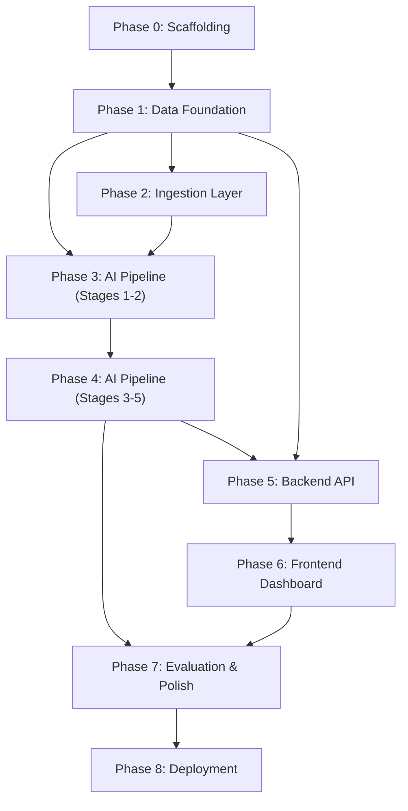

# Implementation Plan — AI-Powered Fashion Purchase Discovery Intelligence Engine

> **Version:** 1.0 (MVP)
> **Last Updated:** 2026-08-18
> **Status:** Draft — Pending Review
> **Reference:** [Architecture.md](file:///Users/raunaqkaicker/Documents/Review%20scraper/docs/Architecture.md) · [problemStatement.md](file:///Users/raunaqkaicker/Documents/Review%20scraper/docs/problemStatement.md)

---

## Implementation Overview

The MVP is broken into **8 phases**, ordered by dependency. Each phase produces a **verifiable, runnable increment** — no phase requires forward references to incomplete work.

```
Phase 0 ─── Scaffolding & Infrastructure
   │
Phase 1 ─── Data Foundation (Schema, Models, Migrations)
   │
Phase 2 ─── Ingestion Layer + Sample Data
   │
Phase 3 ─── AI Pipeline (Stages 1–2: Clean + Enrich)
   │
Phase 4 ─── AI Pipeline (Stages 3–5: Cluster + Patterns + Opportunities)
   │
Phase 5 ─── Backend API + Research Interface
   │
Phase 6 ─── Frontend Dashboard
   │
Phase 7 ─── Evaluation, Integration Testing & Polish
   │
Phase 8 ─── Deployment (Railway + Vercel)
```

### Dependency Graph



---

## Phase 0 — Scaffolding & Infrastructure

> **Goal:** A running dev environment with all services healthy (PostgreSQL, FastAPI, Next.js) and zero application logic.

### 0.1 Environment Setup

| Task | Deliverable |
|---|---|
| Initialize Railway project | `railway init` — setup persistent volumes for data |
| Create `.env.example` | All environment variables documented (DB, Groq, Pipeline, App) |
| Create `Makefile` | Common commands: `make up`, `make down`, `make migrate`, `make seed`, `make test` |

### 0.2 Backend Scaffolding

| Task | Deliverable |
|---|---|
| Initialize Python project | `pyproject.toml`, `requirements.txt` |
| Create FastAPI entry point | `backend/app/main.py` — health check at `/health` |
| Create config module | `backend/app/config.py` — Pydantic Settings loading from `.env` |
| Setup DB session | `backend/app/db/session.py` — async SQLAlchemy engine + session factory |
| Setup Alembic | `backend/alembic/` — initialized, connected to DB |
| Setup linting | Ruff + Black configuration in `pyproject.toml` |

### 0.3 Frontend Scaffolding

| Task | Deliverable |
|---|---|
| Initialize Next.js project | `npx create-next-app` with TypeScript, App Router, Tailwind CSS |
| Install shadcn/ui | Base component library initialized |
| Create design tokens | `frontend/src/styles/design-tokens.css` |
| Create API client stub | `frontend/src/lib/api.ts` — base URL config, fetch wrapper |
| Create TypeScript types | `frontend/src/lib/types.ts` — shared type definitions (stubs) |
| Setup linting | ESLint + Prettier configuration |

### 0.4 Verification

```bash
make setup
# ✅ SQLite database file created locally
# ✅ ChromaDB local persistent directory initialized
# ✅ FastAPI health check returns 200 at http://localhost:8000/health
# ✅ Next.js loads at http://localhost:3000
# ✅ Backend can connect to database
```

**Files Created:**
```
.env.example
Makefile
README.md
backend/Dockerfile
backend/pyproject.toml
backend/requirements.txt
backend/app/__init__.py
backend/app/main.py
backend/app/config.py
backend/app/db/__init__.py
backend/app/db/session.py
backend/alembic/alembic.ini
backend/alembic/env.py
frontend/Dockerfile
frontend/package.json
frontend/tsconfig.json
frontend/next.config.js
frontend/src/app/layout.tsx
frontend/src/app/page.tsx
frontend/src/app/globals.css
frontend/src/styles/design-tokens.css
frontend/src/lib/api.ts
frontend/src/lib/types.ts
```

---

## Phase 1 — Data Foundation

> **Goal:** All database tables exist and are migrated. ORM models are importable and tested. The repository layer can perform basic CRUD.

### 1.1 Enums & Constants

| Task | Deliverable |
|---|---|
| Define `EvidenceLevel` enum | `OBSERVED`, `DERIVED`, `HYPOTHESIZED` |
| Define `JourneyStage` enum | Full 11-stage funnel from `DISCOVERY` to `POST_PURCHASE` |
| Define supporting enums | `TrendDirection`, `AnalysisType`, `SourcePlatform` |

**File:** `backend/app/models/enums.py`

### 1.2 SQLAlchemy ORM Models

Create all 9 entities from [Architecture §5](file:///Users/raunaqkaicker/Documents/Review%20scraper/docs/Architecture.md):

| Model | File | Key Fields |
|---|---|---|
| `DataSource` | `models/feedback.py` | platform, source_type, config, last_fetched |
| `FeedbackItem` | `models/feedback.py` | original_text, cleaned_text, content_hash, source metadata, is_spam, is_duplicate |
| `AISignal` | `models/signals.py` | intent, journey_stage, barrier, motivation, uncertainty, decision_criteria, confidence_score, evidence_level, product context, user context |
| `Cluster` | `models/clusters.py` | label, description, theme, member_count, cohesion_score |
| `ClusterMembership` | `models/clusters.py` | feedback_item_id, cluster_id, similarity_score |
| `Pattern` | `models/patterns.py` | name, pattern_type, evidence_level, occurrence_count, segment/category/time distributions, trend_direction |
| `PatternEvidence` | `models/patterns.py` | pattern_id, cluster_id, feedback_item_id, evidence_type |
| `Opportunity` | `models/opportunities.py` | title, description, segment, barrier, unmet_need, potential_solution, evidence_level, supporting/contradictory evidence |
| `OpportunityScore` | `models/opportunities.py` | 9 scoring dimensions + composite_score + dimension_weights |
| `OpportunityEvidence` | `models/opportunities.py` | opportunity_id, pattern_id, feedback_item_id, evidence_level |

### 1.3 Database Migrations

| Task | Deliverable |
|---|---|
| Generate initial migration | `alembic revision --autogenerate -m "initial_schema"` |
| Apply migration | `alembic upgrade head` |
| Create indexes | As specified in Architecture §5.4 |
| Configure SQLite | Enable foreign key constraints in SQLAlchemy for SQLite |

### 1.4 Repository Layer

| Repository | File | Methods |
|---|---|---|
| `FeedbackRepository` | `db/repositories/feedback_repo.py` | `create()`, `get_by_id()`, `get_by_hash()`, `list_filtered()`, `bulk_create()` |
| `OpportunityRepository` | `db/repositories/opportunity_repo.py` | `create()`, `get_by_id()`, `list_ranked()`, `get_with_evidence()` |
| `EvidenceRepository` | `db/repositories/evidence_repo.py` | `get_drilldown()`, `get_by_pattern()`, `get_by_cluster()` |

### 1.5 Verification

```bash
make migrate
# ✅ All tables created in SQLite
# ✅ Schema verified via alembic

python -m pytest backend/tests/unit/test_models.py
# ✅ All models can be instantiated
# ✅ Enum values are correct
# ✅ Relationships are properly defined

python -m pytest backend/tests/integration/test_repositories.py
# ✅ CRUD operations work against test database
# ✅ Bulk insert works
# ✅ Filtered queries return correct results
```

**Files Created:**
```
backend/app/models/__init__.py
backend/app/models/enums.py
backend/app/models/feedback.py
backend/app/models/signals.py
backend/app/models/clusters.py
backend/app/models/patterns.py
backend/app/models/opportunities.py
backend/app/db/repositories/__init__.py
backend/app/db/repositories/feedback_repo.py
backend/app/db/repositories/opportunity_repo.py
backend/app/db/repositories/evidence_repo.py
backend/alembic/versions/001_initial_schema.py
backend/tests/__init__.py
backend/tests/conftest.py
backend/tests/unit/test_models.py
backend/tests/integration/test_repositories.py
```

---

## Phase 2 — Ingestion Layer + Sample Data

> **Goal:** A realistic sample dataset is loaded into the database through the adapter framework. The system is demonstrable with data.

### 2.1 Adapter Interface

| Task | Deliverable |
|---|---|
| Create `SourceAdapter` ABC | Abstract methods: `fetch()`, `normalize()`, `validate()` |
| Create `Normalizer` | Maps source-specific fields → unified `FeedbackItem` schema, generates content_hash |

**Production Adapter Libraries (Design Reference):**
- **Google Play Store (Android)**: `google-play-scraper` (No auth required)
- **Apple App Store (iOS)**: `app-store-scraper` (No auth required)
- **Reddit**: `praw` (Requires Reddit Developer API Credentials)
- **YouTube**: `google-api-python-client` (YouTube Data API v3)
- **Product Pages**: `playwright` (Headless Chromium scraping for dynamic sites)

**Files:** `backend/app/ingestion/base_adapter.py`, `backend/app/ingestion/normalizer.py`

### 2.2 Production Adapters

| Task | Deliverable |
|---|---|
| Implement `PlayStoreAdapter` | Uses `google-play-scraper` to fetch recent Android reviews |
| Implement `AppStoreAdapter` | Uses `app-store-scraper` to fetch recent iOS reviews |
| Implement `RedditAdapter` | Uses `praw` (Placeholder for API keys) |
| Implement `YouTubeAdapter` | Uses `google-api-python-client` (Placeholder for API keys) |

**Files:**
- `backend/app/ingestion/playstore_adapter.py`
- `backend/app/ingestion/appstore_adapter.py`
- `backend/app/ingestion/reddit_adapter.py`
- `backend/app/ingestion/youtube_adapter.py`

### 2.5 Ingestion Service

| Task | Deliverable |
|---|---|
| Create `IngestionService` | Orchestrates adapter selection, normalization, dedup-hash check, bulk DB insert |

### 2.6 Verification

```bash
make seed
# ✅ 200-300 FeedbackItem records in database
# ✅ 5 DataSource records created
# ✅ No duplicate content_hash values
# ✅ Source platform distribution is as expected

python -m pytest backend/tests/integration/test_ingestion.py
# ✅ MockDataAdapter loads all records
# ✅ Re-running seed does not create duplicates (idempotent)
# ✅ Normalizer correctly maps all required fields
```

**Files Created:**
```
backend/app/ingestion/__init__.py
backend/app/ingestion/base_adapter.py
backend/app/ingestion/normalizer.py
backend/app/ingestion/mock_adapter.py
backend/app/ingestion/appstore_adapter.py
backend/app/ingestion/reddit_adapter.py
backend/app/ingestion/youtube_adapter.py
backend/data/sample/fashion_feedback.json
backend/app/services/ingestion_service.py
backend/tests/integration/test_ingestion.py
```

---

## Phase 3 — AI Pipeline: Stages 1–2 (Cleaning + Enrichment)

> **Goal:** Raw feedback items are cleaned, deduplicated, and enriched with AI-derived signals using Groq LLM. Each feedback item has a corresponding `AISignal` record.

### 3.1 Pipeline Framework

| Task | Deliverable |
|---|---|
| Create `PipelineStage` ABC | Abstract `process()` method, logging, metrics tracking, error handling |
| Create `PipelineOrchestrator` | Executes stages sequentially, tracks status, stores progress in DB |

**Files:** `backend/app/pipeline/base.py`, `backend/app/pipeline/orchestrator.py`

### 3.2 Stage 1 — Cleaning & Deduplication

| Task | Implementation |
|---|---|
| Spam detection | Rule-based filters (URL density, promotional keywords, bot patterns) |
| Near-duplicate detection | SHA-256 hash on normalized text; optional fuzzy matching via MinHash |
| Text normalization | Strip excess whitespace, fix encoding, normalize unicode |
| Language detection | `langdetect` library; tag `language` field |
| Flag setting | Set `is_spam`, `is_duplicate`, `cleaned_text`, `processed_at` |

**File:** `backend/app/pipeline/stage_1_cleaning.py`

### 3.3 Groq LLM Client

| Task | Deliverable |
|---|---|
| Create async Groq API wrapper | `groq_client.py` — handles auth, retries (exp backoff), rate limiting, timeouts |
| Create prompt templates | `prompts.py` — system prompt (behavior analyst role), user prompt template, few-shot examples |
| Create output schemas | `schemas.py` — Pydantic models for structured JSON output validation |
| Configure batch processing | Configurable concurrency (default 10), timeout (30s), max retries (3) |

**Files:** `backend/app/llm/groq_client.py`, `backend/app/llm/prompts.py`, `backend/app/llm/schemas.py`

### 3.4 Stage 2 — Semantic Enrichment

| Task | Implementation |
|---|---|
| Process each cleaned FeedbackItem | Send to Groq with structured output (JSON mode) |
| Extract all AI signals | Intent, journey_stage, motivation, uncertainty, barrier, decision_criteria, desired_outcome, purchase_outcome, external_info_seeking, competitor_mentions, unmet_need, opportunity_theme |
| Extract product context | Product, brand, category, subcategory, price_band, attributes |
| Extract user context | User segment, user type, purchase frequency, category familiarity, intent level |
| Assign evidence level | OBSERVED (directly stated) vs DERIVED (inferred from text) |
| Assign confidence score | 0.0–1.0 based on explicitness of the signal in the text |
| Store results | Create `AISignal` record linked to `FeedbackItem` |

**File:** `backend/app/pipeline/stage_2_enrichment.py`

### 3.5 Verification

```bash
# Run pipeline stages 1-2
python -m backend.app.pipeline.orchestrator --stages 1,2

# ✅ Stage 1:
#    - Spam items flagged (is_spam = true)
#    - Duplicates flagged (is_duplicate = true)
#    - cleaned_text populated for all non-spam items
#    - Language detected

# ✅ Stage 2:
#    - AISignal record exists for every cleaned FeedbackItem
#    - All required fields populated (intent, journey_stage, barrier, etc.)
#    - evidence_level is OBSERVED or DERIVED (never HYPOTHESIZED at this stage)
#    - confidence_score is between 0 and 1
#    - No hallucinated product names or user attributes

python -m pytest backend/tests/unit/test_stage_1.py
python -m pytest backend/tests/unit/test_stage_2.py
python -m pytest backend/tests/integration/test_groq_client.py
```

**Files Created:**
```
backend/app/pipeline/__init__.py
backend/app/pipeline/base.py
backend/app/pipeline/orchestrator.py
backend/app/pipeline/stage_1_cleaning.py
backend/app/pipeline/stage_2_enrichment.py
backend/app/llm/__init__.py
backend/app/llm/groq_client.py
backend/app/llm/prompts.py
backend/app/llm/schemas.py
backend/tests/unit/test_stage_1.py
backend/tests/unit/test_stage_2.py
backend/tests/integration/test_groq_client.py
```

---

## Phase 4 — AI Pipeline: Stages 3–5 (Clustering + Patterns + Opportunities)

> **Goal:** Enriched feedback is clustered semantically, recurring patterns are detected across dimensions, and structured opportunities with scores are generated.

### 4.1 Stage 3 — Semantic Clustering

| Task | Implementation |
|---|---|
| Generate embeddings | Use `sentence-transformers` (`all-MiniLM-L6-v2`) on `cleaned_text` + AI signal summary |
| Store embeddings | Insert into ChromaDB collection (`feedback_embeddings`) |
| Cluster | HDBSCAN with configurable `min_cluster_size` (default: 3) |
| Label clusters | Send representative samples (centroid-nearest items) to Groq for human-readable label + description |
| Calculate quality metrics | Silhouette score, intra-cluster cohesion |
| Persist | Create `Cluster` and `ClusterMembership` records |

**File:** `backend/app/pipeline/stage_3_clustering.py`

### 4.2 Stage 4 — Pattern Detection

| Task | Implementation |
|---|---|
| Cross-dimensional analysis | For each cluster, analyze distribution across: segments, categories, sources, time periods |
| Minimum thresholds | ≥3 occurrences, ≥2 independent sources |
| Trend calculation | Linear regression or moving average over time_distribution; classify as GROWING / STABLE / DECLINING / SEASONAL |
| Strength scoring | Composite of occurrence_count, source_diversity, segment_spread |
| Persist | Create `Pattern` and `PatternEvidence` records |
| Evidence level | Patterns are always `DERIVED` (supported by multiple observations) |

**File:** `backend/app/pipeline/stage_4_patterns.py`

### 4.3 Stage 5 — Opportunity Generation

| Task | Implementation |
|---|---|
| Synthesize patterns | Send top patterns to Groq with the Opportunity Framework template |
| Structure output | User Segment → Context → Behavior → Barrier → Evidence → Business Impact → Unmet Need → Opportunity |
| Evidence compilation | Link supporting conversations, count independent sources, identify contradictory evidence |
| Evidence level | Opportunities are `HYPOTHESIZED` (business implications derived from patterns) |
| Persist | Create `Opportunity` and `OpportunityEvidence` records |

**File:** `backend/app/pipeline/stage_5_opportunities.py`

### 4.4 Opportunity Scoring Engine

| Task | Implementation |
|---|---|
| Calculate 9 dimensions | Reach, Frequency, Severity, Business Impact, Evidence Strength, Cross-Source Consistency, Cross-Segment Relevance, Trend, Strategic Relevance |
| Compute composite score | Weighted sum with default weights from Architecture §7.2 |
| Store scores | Create `OpportunityScore` records with individual + composite scores |

**File:** `backend/app/services/opportunity_service.py` (scoring logic)

### 4.5 Full Pipeline Orchestrator Update

| Task | Implementation |
|---|---|
| Wire stages 3–5 into orchestrator | Sequential execution with DB checkpoints between stages |
| Add stage-selection support | `--stages 1,2,3,4,5` or `--stages 3,4,5` for partial re-runs |
| Add status tracking | Pipeline run status (PENDING → RUNNING → COMPLETED / FAILED) with timestamps |

### 4.6 Verification

```bash
# Run full pipeline (all 5 stages)
python -m backend.app.pipeline.orchestrator --stages 1,2,3,4,5

# ✅ Stage 3:
#    - Clusters created with meaningful labels (not "Cluster 0", "Cluster 1")
#    - Each cluster has ≥ min_cluster_size members
#    - Cohesion scores are reasonable (> 0.5)
#    - Semantically similar items are in the same cluster

# ✅ Stage 4:
#    - Patterns detected with ≥3 occurrences
#    - Patterns span ≥2 sources
#    - Trend direction assigned
#    - Segment and category distributions populated

# ✅ Stage 5:
#    - Opportunities generated with all framework fields populated
#    - Each opportunity linked to ≥1 pattern
#    - Evidence level is HYPOTHESIZED
#    - Contradictory evidence surfaced where applicable
#    - Opportunity scores calculated (all 9 dimensions + composite)

# ✅ Full drill-down works:
#    Opportunity → Pattern → Cluster → FeedbackItem → DataSource

python -m pytest backend/tests/unit/test_stage_3.py
python -m pytest backend/tests/unit/test_stage_4.py
python -m pytest backend/tests/unit/test_stage_5.py
python -m pytest backend/tests/integration/test_full_pipeline.py
```

**Files Created:**
```
backend/app/pipeline/stage_3_clustering.py
backend/app/pipeline/stage_4_patterns.py
backend/app/pipeline/stage_5_opportunities.py
backend/app/services/opportunity_service.py
backend/tests/unit/test_stage_3.py
backend/tests/unit/test_stage_4.py
backend/tests/unit/test_stage_5.py
backend/tests/integration/test_full_pipeline.py
```

---

## Phase 5 — Backend API + Research Interface

> **Goal:** All REST endpoints are live and documented. The natural-language research interface translates PM questions into structured analysis. API returns evidence-backed responses.

### 5.1 Shared Dependencies

| Task | Deliverable |
|---|---|
| Create dependency injection | DB session provider, service factories |
| Create middleware | CORS, request logging, error handling, response envelope wrapper |
| Create Pydantic schemas | Request/response models for all endpoints |

**File:** `backend/app/api/deps.py`

### 5.2 Pipeline & Ingestion Endpoints

| Endpoint | Implementation |
|---|---|
| `POST /api/v1/pipeline/run` | Trigger full or partial pipeline execution (background task) |
| `GET /api/v1/pipeline/status` | Return current pipeline run status + per-stage progress |
| `POST /api/v1/ingest` | Trigger data ingestion from specified source |
| `GET /api/v1/ingest/sources` | List configured data sources with last-fetched timestamps |

**Files:** `backend/app/api/v1/pipeline.py`, `backend/app/api/v1/ingest.py`
**Service:** `backend/app/services/pipeline_service.py`

### 5.3 Opportunity Endpoints

| Endpoint | Implementation |
|---|---|
| `GET /api/v1/opportunities` | List opportunities with filtering (category, segment, evidence_level), sorting (composite_score, any dimension), pagination |
| `GET /api/v1/opportunities/{id}` | Full opportunity detail with evidence summary |
| `GET /api/v1/opportunities/{id}/evidence` | Drill-down: linked patterns, clusters, feedback items |
| `GET /api/v1/opportunities/compare` | Side-by-side comparison across segments |
| `PUT /api/v1/opportunities/score/weights` | Update scoring weights → re-calculate composite scores |

**File:** `backend/app/api/v1/opportunities.py`

### 5.4 Evidence Endpoints

| Endpoint | Implementation |
|---|---|
| `GET /api/v1/evidence/feedback/{id}` | Original feedback with source metadata |
| `GET /api/v1/evidence/cluster/{id}` | Cluster detail + member list |
| `GET /api/v1/evidence/pattern/{id}` | Pattern detail with supporting evidence |
| `GET /api/v1/evidence/drilldown` | Full chain: Opportunity → Pattern → Cluster → Feedback → Source |

**File:** `backend/app/api/v1/evidence.py`
**Service:** `backend/app/services/evidence_service.py`

### 5.5 Segment & Trend Endpoints

| Endpoint | Implementation |
|---|---|
| `GET /api/v1/segments/compare` | Compare barrier/opportunity distributions across segments (category, user type, price band, intent level) |
| `GET /api/v1/trends` | Trend analysis for patterns (growing, stable, declining, seasonal) |
| `GET /api/v1/journey/stages` | Journey-stage distribution: issue counts per stage |

**Files:** `backend/app/api/v1/segments.py`, `backend/app/api/v1/trends.py`
**Service:** `backend/app/services/segment_service.py`

### 5.6 Natural Language Research Interface

This is the most complex backend feature. Implement it as a multi-step orchestration:

```
PM Question → Query Analyzer (Groq) → Structured Query → DB + Vector Search → LLM Synthesis → Response
```

| Step | Implementation |
|---|---|
| **Query Analyzer** | Send PM's question to Groq → extract `analysis_type`, `filters`, `comparison`, `time_range`, `focus_areas` |
| **Query Router** | Route to appropriate handler: barrier analysis, segment comparison, trend analysis, factor analysis, opportunity discovery |
| **DB Query Builder** | Translate structured query into SQLAlchemy filters on opportunities, patterns, signals |
| **Vector Search** | (Optional) Semantic search for relevant clusters if query doesn't match pre-computed patterns |
| **LLM Synthesis** | Send retrieved data to Groq → generate executive insight, rank relevant opportunities, compile evidence |
| **Response Assembly** | Format as research response with evidence_summary metadata |

| Endpoint | Implementation |
|---|---|
| `POST /api/v1/research/query` | Submit question → returns query ID (async processing) |
| `GET /api/v1/research/query/{id}` | Get results (polling or SSE for real-time) |
| `GET /api/v1/research/suggestions` | Return curated suggested questions based on data coverage |

**File:** `backend/app/api/v1/research.py`
**Service:** `backend/app/services/research_service.py`

### 5.7 Verification

```bash
# Start the backend
make up

# ✅ OpenAPI docs accessible at http://localhost:8000/docs
# ✅ All endpoints listed with correct schemas

# Test pipeline trigger
curl -X POST http://localhost:8000/api/v1/pipeline/run
# ✅ Returns pipeline run ID and status

# Test opportunities
curl http://localhost:8000/api/v1/opportunities?sort_by=composite_score&order=desc
# ✅ Returns ranked opportunities with scores and evidence summaries

# Test evidence drill-down
curl http://localhost:8000/api/v1/evidence/drilldown?opportunity_id=<id>
# ✅ Returns full chain: Opportunity → Patterns → Clusters → Feedback → Source

# Test research interface
curl -X POST http://localhost:8000/api/v1/research/query \
  -H "Content-Type: application/json" \
  -d '{"question": "Why do users wishlist dresses but not buy them?"}'
# ✅ Returns executive insight + ranked opportunities + evidence

# Test segment comparison
curl "http://localhost:8000/api/v1/segments/compare?dimension=user_type&values=new,returning"
# ✅ Returns side-by-side barrier distributions

python -m pytest backend/tests/integration/test_api_*.py
```

**Files Created:**
```
backend/app/api/__init__.py
backend/app/api/deps.py
backend/app/api/v1/__init__.py
backend/app/api/v1/research.py
backend/app/api/v1/opportunities.py
backend/app/api/v1/evidence.py
backend/app/api/v1/segments.py
backend/app/api/v1/trends.py
backend/app/api/v1/pipeline.py
backend/app/api/v1/ingest.py
backend/app/services/__init__.py
backend/app/services/research_service.py
backend/app/services/evidence_service.py
backend/app/services/segment_service.py
backend/app/services/pipeline_service.py
backend/tests/integration/test_api_opportunities.py
backend/tests/integration/test_api_research.py
backend/tests/integration/test_api_evidence.py
```

---

## Phase 6 — Frontend Dashboard

> **Goal:** A polished, PM-oriented dashboard with all 8 sections from Architecture §10 functional and connected to live API data.

### 6.1 Layout & Navigation Shell

| Task | Deliverable |
|---|---|
| Create root layout | Sidebar navigation + main content area + Research Bar (persistent top) |
| Create navigation items | Overview, Opportunities, Journey, Segments, Factors, Evidence, Trends, Settings |
| Implement responsive design | Collapsible sidebar, mobile-friendly |
| Dark mode support | System preference detection + manual toggle |

**Files:**
- `frontend/src/app/layout.tsx`
- `frontend/src/app/page.tsx`
- `frontend/src/components/shared/Sidebar.tsx`
- `frontend/src/components/shared/TopBar.tsx`

### 6.2 Research Bar & Query Flow

| Task | Deliverable |
|---|---|
| `ResearchBar` component | Natural language input with placeholder examples, loading states |
| `QuerySuggestions` component | Suggested queries from API, recent query history |
| `useResearch` hook | Submit query, poll for results, cache history |

**Files:**
- `frontend/src/components/research/ResearchBar.tsx`
- `frontend/src/components/research/QuerySuggestions.tsx`
- `frontend/src/hooks/useResearch.ts`

### 6.3 Executive Insight Panel

| Task | Deliverable |
|---|---|
| `ExecutiveInsight` component | Concise answer summary, key metrics (conversations, sources, confidence), evidence level badge |
| `ConfidenceIndicator` component | Visual confidence meter (low/medium/high) |
| `EvidenceBadge` component | Color-coded badge: Observed (green), Derived (blue), Hypothesized (amber) |

**Files:**
- `frontend/src/components/shared/ExecutiveInsight.tsx`
- `frontend/src/components/shared/ConfidenceIndicator.tsx`
- `frontend/src/components/shared/EvidenceBadge.tsx`

### 6.4 Opportunity Map

| Task | Deliverable |
|---|---|
| `OpportunityMap` component | Ranked card grid, sortable by composite or individual scores |
| `OpportunityCard` component | Title, segment, barrier, unmet need, composite score, evidence badge, trend indicator |
| `ScoreBreakdown` component | Radar chart or horizontal bars showing all 9 scoring dimensions |
| `useOpportunities` hook | Fetch, filter, sort, paginate opportunities |
| Opportunity detail page | `/opportunities/[id]` — full opportunity view with evidence drill-down |

**Files:**
- `frontend/src/components/opportunities/OpportunityMap.tsx`
- `frontend/src/components/opportunities/OpportunityCard.tsx`
- `frontend/src/components/opportunities/ScoreBreakdown.tsx`
- `frontend/src/hooks/useOpportunities.ts`
- `frontend/src/app/opportunities/[id]/page.tsx`

### 6.5 Journey Visualization

| Task | Deliverable |
|---|---|
| `JourneyVisualization` component | Horizontal funnel or Sankey diagram showing issue distribution across journey stages |
| Interactive stages | Click a stage → filter opportunities to that stage |
| Heatmap overlay | Color intensity based on barrier frequency per stage |

**File:** `frontend/src/components/journey/JourneyVisualization.tsx`

### 6.6 Evidence Panel & Drill-Down

| Task | Deliverable |
|---|---|
| `EvidencePanel` component | Source distribution pie chart, sample conversations list, platform badges |
| `DrillDown` component | Expandable chain: Opportunity → Pattern → Cluster → Feedback → Source |
| `ContradictionPanel` component | Counter-evidence with source attribution, side-by-side with supporting evidence |
| `useEvidence` hook | Fetch evidence drill-down, cluster details, pattern details |

**Files:**
- `frontend/src/components/evidence/EvidencePanel.tsx`
- `frontend/src/components/evidence/DrillDown.tsx`
- `frontend/src/components/evidence/ContradictionPanel.tsx`
- `frontend/src/hooks/useEvidence.ts`

### 6.7 Segment Comparer

| Task | Deliverable |
|---|---|
| `SegmentComparer` component | Side-by-side comparison of 2 segments, bar charts for barrier distribution |
| Segment selector | Dropdowns for dimension (category, user type, price band) and values |

**File:** `frontend/src/components/segments/SegmentComparer.tsx`

### 6.8 Decision Factors & Trends

| Task | Deliverable |
|---|---|
| `DecisionFactors` component | Radar chart or heatmap of factors (Fit, Price, Reviews, Styling, Quality, Occasion, Social proof) |
| `TrendAnalysis` component | Line chart showing pattern trends over time, with growing/declining badges |

**Files:**
- `frontend/src/components/factors/DecisionFactors.tsx`
- `frontend/src/components/trends/TrendAnalysis.tsx`

### 6.9 Settings Panel

| Task | Deliverable |
|---|---|
| Score weight configuration | Sliders for each scoring dimension weight, "Reset to Default" button |
| Pipeline controls | Trigger pipeline run, view status |

### 6.10 Verification

```bash
make up
# Navigate to http://localhost:3000

# ✅ Dashboard loads with sidebar navigation
# ✅ Research Bar accepts questions and shows loading state
# ✅ Research results render: Executive Insight + Opportunity Map
# ✅ Opportunity cards show scores, evidence badges, trend indicators
# ✅ Clicking an opportunity opens detail view with evidence drill-down
# ✅ Journey visualization renders with clickable stages
# ✅ Evidence panel shows source distribution and sample conversations
# ✅ Drill-down chain navigates: Opportunity → Pattern → Cluster → Feedback
# ✅ Segment comparer shows side-by-side comparison
# ✅ Decision factors renders radar/heatmap chart
# ✅ Trend analysis shows time-based line chart
# ✅ Score weights are adjustable and trigger re-ranking
# ✅ Contradictions panel surfaces counter-evidence
# ✅ Responsive layout works on smaller screens
```

**Files Created:**
```
frontend/src/components/research/ResearchBar.tsx
frontend/src/components/research/QuerySuggestions.tsx
frontend/src/components/opportunities/OpportunityMap.tsx
frontend/src/components/opportunities/OpportunityCard.tsx
frontend/src/components/opportunities/ScoreBreakdown.tsx
frontend/src/components/journey/JourneyVisualization.tsx
frontend/src/components/evidence/EvidencePanel.tsx
frontend/src/components/evidence/DrillDown.tsx
frontend/src/components/evidence/ContradictionPanel.tsx
frontend/src/components/segments/SegmentComparer.tsx
frontend/src/components/factors/DecisionFactors.tsx
frontend/src/components/trends/TrendAnalysis.tsx
frontend/src/components/shared/Sidebar.tsx
frontend/src/components/shared/TopBar.tsx
frontend/src/components/shared/ExecutiveInsight.tsx
frontend/src/components/shared/ConfidenceIndicator.tsx
frontend/src/components/shared/EvidenceBadge.tsx
frontend/src/hooks/useResearch.ts
frontend/src/hooks/useOpportunities.ts
frontend/src/hooks/useEvidence.ts
frontend/src/app/opportunities/[id]/page.tsx
```

---

## Phase 7 — Evaluation, Integration Testing & Polish

> **Goal:** The system is verified for AI quality, evidence integrity, and hallucination control. Documentation is complete. End-to-end flow is tested.

### 7.1 Golden Test Dataset

| Task | Deliverable |
|---|---|
| Curate 50–100 labeled items | Human-labeled expected outputs for: intent, journey stage, barriers, decision criteria, cluster assignments |
| Create evaluation runner | Script that compares AI output against golden labels |
| Compute metrics | Classification accuracy, recall per field, confusion matrices |

**Files:** `backend/data/evaluation/golden_labels.json`, `backend/tests/evaluation/test_classification.py`

### 7.2 Evaluation Checks

| Evaluation Area | Test | Pass Criteria |
|---|---|---|
| **Classification Quality** | Compare AI signals to golden labels | ≥70% accuracy on intent, journey stage, barrier |
| **Clustering Quality** | Silhouette score + manual sample review | Silhouette > 0.3; thematic coherence in cluster labels |
| **Evidence Traceability** | Automated integrity check: every opportunity → pattern → cluster → feedback | 100% of opportunities have complete evidence chain |
| **Hallucination Control** | Check for fabricated quotes, non-existent products, unsupported causal claims | 0 fabricated quotes; 0 unsupported causal claims |
| **Opportunity Quality** | Manual review rubric: actionable, specific, distinct | Reviewed by human; subjective quality pass |

**File:** `backend/tests/evaluation/test_quality.py`

### 7.3 Evidence Integrity Checks

| Task | Deliverable |
|---|---|
| Traceability audit script | Walk every Opportunity → verify Pattern → Cluster → FeedbackItem → DataSource links exist |
| Orphan detection | Find any orphaned clusters, patterns, or evidence records |
| Confidence propagation check | Verify downstream confidence ≤ upstream confidence |

**File:** `backend/tests/evaluation/test_evidence_integrity.py`

### 7.4 End-to-End Integration Test

| Task | Deliverable |
|---|---|
| Full flow test | Ingest → Pipeline (all 5 stages) → API → Research query → Dashboard render |
| Playwright E2E test | Navigate dashboard, submit research question, verify results render with evidence |

**File:** `backend/tests/integration/test_e2e_flow.py`, `frontend/tests/e2e/dashboard.spec.ts`

### 7.5 Documentation

| Document | Contents |
|---|---|
| `README.md` | Project overview, quick start, architecture summary, demo walkthrough |
| `docs/api-spec.yaml` | OpenAPI 3.0 spec (auto-generated from FastAPI + manual review) |
| Setup instructions | In README: prerequisites, Docker setup, env config, seed data, run pipeline, open dashboard |
| Architectural decisions | Already in Architecture.md (ADRs) |

### 7.6 Polish

| Task | Details |
|---|---|
| Error states in UI | Empty states, error boundaries, retry prompts |
| Loading skeletons | Skeleton loaders for all async-fetched sections |
| Tooltips & help text | Explain evidence levels, scoring dimensions, confidence on hover |
| Performance | Lazy-load heavy components (charts, drill-down), API response pagination |
| SEO | Title tags, meta descriptions, semantic HTML, heading hierarchy |

### 7.7 Verification

```bash
# Run all tests
make test

# ✅ Unit tests pass (models, pipeline stages, services)
# ✅ Integration tests pass (repositories, API endpoints, pipeline)
# ✅ Evaluation tests pass (classification, clustering, evidence integrity)
# ✅ E2E tests pass (dashboard flow with Playwright)

# Manual verification
# ✅ Full demo: Ingest data → Run pipeline → Ask research question → See results
# ✅ Evidence drill-down works end-to-end
# ✅ Score weight adjustment triggers re-ranking
# ✅ Segment comparison shows meaningful differences
# ✅ No fabricated quotes or unsupported claims in outputs
```

**Files Created:**
```
backend/data/evaluation/golden_labels.json
backend/tests/evaluation/__init__.py
backend/tests/evaluation/test_classification.py
backend/tests/evaluation/test_quality.py
backend/tests/evaluation/test_evidence_integrity.py
backend/tests/integration/test_e2e_flow.py
frontend/tests/e2e/dashboard.spec.ts
docs/api-spec.yaml
README.md (updated)
```

---

## Phase 8 — Deployment (Render)

> **Goal:** The full application is deployed to production on Render — unified under a single Blueprint (`render.yaml`) — with environment variables configured, databases provisioned, and public URLs active.

### 8.1 Unified Deployment — Render Blueprint

| Task | Deliverable |
|---|---|
| Create `render.yaml` | Define PostgreSQL, Backend Web Service (FastAPI), and Frontend Web Service (Next.js) |
| Provision PostgreSQL | Render managed PostgreSQL instance |
| Provision persistent volume | For ChromaDB vector store persistence (`/data`) |
| Configure environment variables | `DATABASE_URL` (mapped from DB), `GROQ_API_KEY` (manual sync), `APP_ENV=production` |
| Configure Frontend Env | Map backend's `RENDER_EXTERNAL_URL` to `NEXT_PUBLIC_API_URL` for frontend |
| Build commands | Backend: pip install requirements. Frontend: `npm run build` |
| Start commands | Backend: `alembic upgrade head && uvicorn app.main:app` |
| Configure CORS | Allow the Render frontend domain in CORS origins |

**Files:**
- `render.yaml` (new)
- `backend/app/config.py` (modified)
- `backend/app/main.py` (CORS update)

### 8.2 Database Migration (SQLite → PostgreSQL)

| Task | Deliverable |
|---|---|
| Update SQLAlchemy engine config | Detect `DATABASE_URL` scheme — use `asyncpg` for PostgreSQL, `aiosqlite` for SQLite |
| Remove `check_same_thread` for PostgreSQL | Only pass this connect arg when using SQLite |
| Test migrations against PostgreSQL | `alembic upgrade head` runs cleanly on Render's PostgreSQL |
| Seed production data | Run ingestion pipeline once post-deploy to populate the database |

### 8.3 CI/CD Pipeline (Render)

| Task | Deliverable |
|---|---|
| Render auto-deploy | Enable automatic deploys in Render dashboard for pushes to `main` |

### 8.4 Verification

```bash
# ✅ Backend health check
curl https://<render-backend-app>.onrender.com/health
# Returns: {"status": "ok"}

# ✅ Frontend loads
# Navigate to https://<render-frontend-app>.onrender.com
# Dashboard renders with live data from Render backend

# ✅ Research query works end-to-end
curl -X POST https://<render-backend-app>.onrender.com/api/v1/research/ask \
  -H "Content-Type: application/json" \
  -d '{"query": "What sizing issues do users face?"}'
# Returns AI-generated answer with sources

# ✅ Pipeline can be triggered remotely
curl -X POST https://<render-backend-app>.onrender.com/api/v1/pipeline/run
# Returns pipeline run status
```

**Files Created/Modified:**
```
render.yaml
backend/app/config.py (modified)
backend/app/db/session.py (modified)
backend/app/main.py (CORS update)
backend/requirements.txt (asyncpg added)
```

---

## Summary

### Phase → Deliverable Matrix

| Phase | Core Deliverables | Depends On |
|---|---|---|
| **0. Scaffolding** | Docker Compose, FastAPI app, Next.js app, DB connection, Alembic | — |
| **1. Data Foundation** | 9 ORM models, migrations, enums, repository layer | Phase 0 |
| **2. Ingestion** | Adapter framework, 200–300 item sample dataset, MockDataAdapter | Phase 1 |
| **3. Pipeline 1–2** | Cleaning stage, Groq client, enrichment stage, AI signals | Phase 1, 2 |
| **4. Pipeline 3–5** | Clustering, pattern detection, opportunity generation, scoring engine | Phase 3 |
| **5. Backend API** | 20+ REST endpoints, research interface, segment/trend analysis | Phase 1, 4 |
| **6. Frontend** | 8-section dashboard, 17+ components, 3 hooks, research flow | Phase 5 |
| **7. Evaluation** | Golden dataset, quality tests, integrity checks, E2E tests, docs | Phase 4, 6 |
| **8. Deployment** | Render blueprint, PostgreSQL migration, CORS | Phase 7 |

### Total File Count

| Layer | Estimated Files |
|---|---|
| Infrastructure | ~10 |
| Backend Models & DB | ~15 |
| Ingestion | ~8 |
| Pipeline | ~10 |
| LLM | ~4 |
| Backend API & Services | ~18 |
| Frontend Components | ~21 |
| Frontend Hooks & Lib | ~6 |
| Tests | ~15 |
| Documentation | ~4 |
| Deployment & CI/CD | ~5 |
| **Total** | **~116 files** |

---

> [!TIP]
> Each phase is designed to be **independently verifiable**. After completing a phase, run its verification steps before moving to the next. This catches integration issues early and ensures the system builds on a stable foundation.
